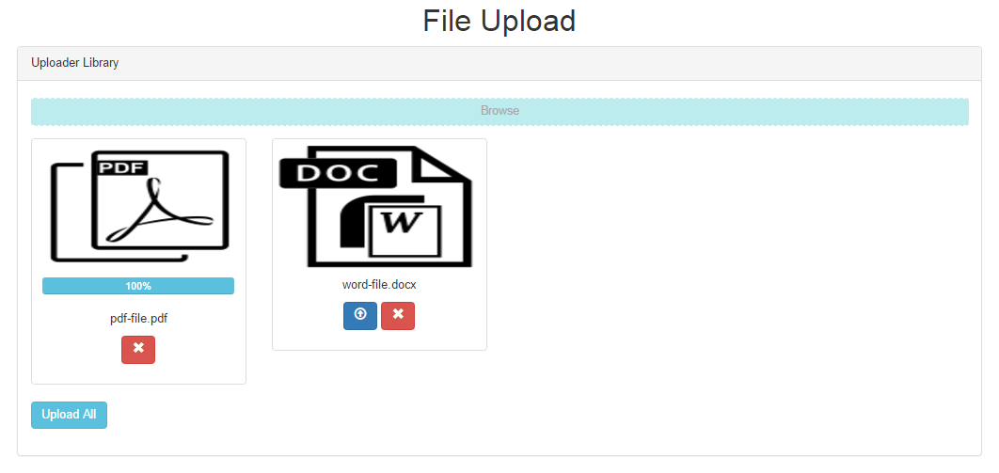

# file-upload
Upload Single and Multi Files

### Visits




## Installion Require Bootstrap getbootstrap.com & JQuery File
Set Css Links In Header .. 
Set Js Files In Footer ..
```
	<link rel="stylesheet" href="https://maxcdn.bootstrapcdn.com/bootstrap/3.3.6/css/bootstrap.min.css" integrity="sha384-1q8mTJOASx8j1Au+a5WDVnPi2lkFfwwEAa8hDDdjZlpLegxhjVME1fgjWPGmkzs7" crossorigin="anonymous">
	<link rel="stylesheet" type="text/css" href="includes/custom.css">	
	<script src="https://ajax.googleapis.com/ajax/libs/jquery/1.11.3/jquery.min.js"></script>
	<script type="text/javascript" src="includes/custom.js" ></script>
```

## Form 
```
  	<form method="post" id="uploader" >

		<div class="form-group dropFile1">
	        <span class="btn btn-file btn-block">
	            Browse <input type="file" id="files-upload" multiple>
	        </span>
	    </div>
    	<div class="files row"></div>
    
		    <div class="my_file hidden">
		    	<div class="col-sm-3 col-md-3 file">
				    <div class="thumbnail">
				      
				      <div class="caption">
				        <input type="hidden" name="files[]">
				        <div class="progress hidden">
							<div class="progress-bar progress-bar-info" role="progressbar" aria-valuenow="60" aria-valuemin="0" aria-valuemax="100" style="width: 0%;">
							    0%
							</div>
						</div>
						<p align="center" class="file-name" >  </p>
				        <p align="center">
				        	<a class="btn btn-primary fl-upload" data-file="" >
				        		<span class="glyphicon glyphicon-upload" ></span>
				        	</a>
				        	<a class="btn btn-danger rm-file">
				        		<span class="glyphicon glyphicon-remove" aria-hidden="true"></span>
				        	</a>
				        </p>
				      </div>
				    </div>
				</div>	
		    </div>
	    <div class="form-group">
	    	<a class="btn btn-info multi-upload" > Upload All </a>
	    </div>
	</form>
```

## Uploader
```
$(document).ready(function()
{
	// About Signle Upload ..
	$('.files').on('click' , '.fl-upload' , function()
	{
		var currentFile = $(this).parents('.caption');
		var num 		= $(this).attr('data-file');
		var data_form 	= new FormData();
		
		data_form.append('files[]' , $('input[type=file]').prop('files')[num]);
		
		$.ajax({
			url 	: 'upload.php',
			type 	: 'POST', 
			data 	: data_form,
			cache	: false,
	        contentType: false,
	        processData: false,
	        dataType: "json",
	        headers: {
	            'X-CSRF-TOKEN': $('meta[name="csrf-token"]').attr('content')
	        },
	        xhr: function() {
			    var xhr = new window.XMLHttpRequest();
			    xhr.upload.addEventListener("progress", function(evt) {
			      if (evt.lengthComputable) {
			        var percentComplete = evt.loaded / evt.total;
			        percentComplete = parseInt(percentComplete * 100);
			        
			        currentFile.find('.progress').removeClass('hidden');
			        currentFile.find('.progress-bar').css('width' , percentComplete+'%');
			        currentFile.find('.progress-bar').html(percentComplete+'%');
			        
			        if (percentComplete === 100) {

			        }

			      }
			    }, false);
			    return xhr;
			},
			beforeSend : function() {
				
			},	
	        success : function(data) {
	        	if(data.status == 1) {
	        		currentFile.find('input[name="files[]"]').remove();
	        		currentFile.find('.fl-upload').remove();
	        	}
	        },
	        error:function() {

	        }
		});
		return false;
	});

	// About Multi Upload ...
	$('body').on('click' , '.multi-upload' ,  function()
	{
		var $this = $('.files');
		var data_form = new FormData();

		var files = $('input[name="files[]"]').map(function(){
			data_form.append('files[]' , $('input[type=file]').prop('files')[$(this).val()]);
		});

		$.ajax({
			url 	: 'upload.php',
			type 	: 'POST', 
			data 	: data_form,
			cache	: false,
	        contentType: false,
	        processData: false,
	        dataType: "json",
	        headers: {
	            'X-CSRF-TOKEN': $('meta[name="csrf-token"]').attr('content')
	        },
	        xhr: function() {
			    var xhr = new window.XMLHttpRequest();
			    xhr.upload.addEventListener("progress", function(evt) {
			      if (evt.lengthComputable) {
			        var percentComplete = evt.loaded / evt.total;
			        percentComplete = parseInt(percentComplete * 100);
			        //$('.fullupload').removeClass('hidden');
			        $this.find('.progress').removeClass('hidden');
			        $this.find('.progress-bar').css('width' , percentComplete+'%');
			        $this.find('.progress-bar').html(percentComplete+'%');
			        if (percentComplete === 100) {

			        }

			      }
			    }, false);
			    return xhr;
			},
			beforeSend : function() {
				
			},	
	        success : function(data) {
	        	if(data.status == 1) {
	        		$('.files input[name="files[]"]').remove();
	        		$('.files .fl-upload').remove();
	        	}
	        }
		});
		return false;
	})

	// Remove File ..
	$('body').on('click' , '.rm-file' , function () {
		$(this).parents('.my_file').remove();
	})
})
```